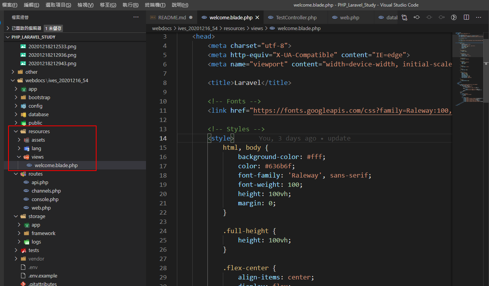

# PHP Laravel Study(搭配MYSQL)

# 可以使用PHP下載安裝

https://windows.php.net/download#php-7.3

# 或使用 PHPStudy下載安裝(集成環境)

https://www.xp.cn/download.html


# Composer下載安裝

https://getcomposer.org/download/


# Composer切換鏡像

https://pkg.phpcomposer.com/

# Composer部署laravel項目

```bash
# composer: 表示執行composer程序
# create-project: 通過composer去創建項目
# laravel/laravel: 需要創建的項目名稱
# --prefer-dist: 優先下載壓縮包方式，而不是直接從github上下載源碼(克隆)
# /: 表示創建的項目目錄名稱，也可以是一個目錄名

# laravel若不指定版本號，則默認使用最新的版本號

composer create-project laravel/laravel --prefer-dist ./

composer create-project laravel/laravel --prefer-dist ./QZ_04_1223
```

運行指令


得到這樣的目錄結構


```bash
# 下載其它版本號可使用下面命令
composer create-project laravel/laravel=5.4.*  --prefer-dist ./

composer create-project laravel/laravel=5.4.* --prefer-dist ./QZ_04_1224
```


```bash
composer create-project laravel/laravel=5.1.* --prefer-dist ./ives_2020122702
```


更新composer版本
```bash
composer self-update
```

# Laravel 目錄結構分析

每個版本似乎都不太相同，這邊看的是5.4.30


# 啟動Laravel - 方式一

不推薦這方式啟動

- 能夠跑php代碼，但是不啟動數據庫。
- 該方式啟動後，如果修改項目的配置.env的話，需要重啟才會生效。

```bash
php artisan serve
```


# 啟動Laravel - 方式二: 使用wamp或lamp

## 虛擬主機配置 (虛擬主機 不等於 虛擬機)

設定好之後，啟動apache之後，laravel文件若有存檔會自動更新

修改apache的虛擬主機vhost的配置文件


```conf
<VirtualHost *:80>
   # 配置站點管理員郵箱，當站點產生500錯誤的時候會顯示在頁面上
   ServerAdmin ivesshe@gmail.com
   # 站點的根目錄
   DocumentRoot "D:\PHP\PHP_Laravel_Study\webdocs\ives_20201216_54\public"
   FcgidInitialEnv PHPRC "D:/phpstudy_pro/Extensions/php/php7.3.4nts"
   AddHandler fcgid-script .php
   FcgidWrapper "D:/phpstudy_pro/Extensions/php/php7.3.4nts/php-cgi.exe" .php
   # DocumentRoot "${SRVROOT}/docs/dummy-host.example.com"

   # 站點需要綁定的域名
   ServerName www.1223.com
   #ServerName dummy-host.example.com

   # 服務器別名的域名
   ServerAlias 1223.com
   #ServerAlias www.dummy-host.example.com
   
   # 針對站點的詳細配置 
   # +是顯示目錄結構、-是關閉目錄結構，對外的網站需用-
   <Directory "D:\PHP\PHP_Laravel_Study\webdocs\ives_20201216_54\public">
     allow from all
     AllowOverride all
     Options +indexes 
   </Directory>
   ErrorLog "logs/dummy-host.example.com-error.log"
   CustomLog "logs/dummy-host.example.com-access.log" common
</VirtualHost>
```

## 修改hosts文件(線上的叫DNS域名解析)


# 路由


```php
Route::請求方式('請求的url',匿名函數或控制響應的方法)
```

```php
// 根路由 
Route::get('/', function () {
    return view('welcome');
});

Route::get('/home', function () {
    echo '當前訪問的地址是/home';
});

// any語法
Route::any('/anyTest', function () {
    echo '當前訪問的地址是/anyTest';
});

// match語法
Route::match(['get','post'],'/matchTest', function () {
    echo '當前訪問的地址是/matchTest';
});

// 必選參數
Route::any('/anyTest2/{id}', function ($id) {
    echo '當前訪問的地址是/anyTest2 , 當前用戶的id是 ' .$id;
});

// 可選參數
Route::any('/anyTest3/{id?}', function ($id='') {
    echo '當前訪問的地址是/anyTest3 , 當前用戶的id是 ' .$id;
});

// 通過?形式傳遞get參數
Route::any('/anyTest4', function () {
    echo '當前訪問的地址是/anyTest4  ' .$_GET['id'];
});


// 路由別名
Route::any('/anyTest5', function () {
    echo '當前訪問的地址是/anyTest5  ' .$_GET['id'];
}) -> name('ives');
```


查看系統已有的路由命令

```bash
php artisan route:list
```


# 路由群組

```php
// 路由群組
Route::group(['prefix' => 'admin'], function () {
    Route::get('test1', function () {
        echo '當前訪問的地址是/admin/test1';
    });

    Route::get('test2', function () {
        echo '當前訪問的地址是/admin/test2';
    });

    Route::get('test3', function () {
        echo '當前訪問的地址是/admin/test3';
    });
});
```


# 控制器-結構代碼生成

```bash
php artisan make:controller 控制器名(大駝峰) +Controller 關鍵詞
```

例如使用artisan命令創建TestController.php文件

```bash
php artisan make:controller TestController
```


# 控制器-路由(項目以該方式為主)

編寫路由規則：

設定路由： /home/test/test1         /p/c/a

```php
// 控制器路由寫法
Route::get('/home/test/test1', 'TestController@test1');
```


# 控制器-支持分目錄管理

1. 創建控制器目錄

2. 創建控制器文件(使用artisan命令創建)
```bash
php artisan make:controller Admin/IndexController

php artisan make:controller Home/IndexController
```


web.php
```php
// 分目錄管理
Route::get('/home/index/index', 'Home\IndexController@index');
Route::get('/admin/index/index', 'Admin\IndexController@index');
```


# 接收用戶輸入

設定別名


```php
// 自己添加別名
'Input' => Illuminate\Support\Facades\Input::class,
```

增加測試路由


```php
// 增加測試路由
Route::get('/home/test/test2', 'TestController@test2');
```


```php
use Input;

// test2測試Input獲取數據
public function test2(){
    echo Input::get('id','10086') . '<br/>';

        // 獲取全部的值(數組型式的返回)
        $all = Input::all();
        //var_dump($all);

        // dd = dump+die
        //dd($all);   

        // 獲取指定的信息(字符串型式)
        //dd(Input::get('name'));

        // 獲取指定的幾個值(數組型式)
        //dd(Input::only(['id','name']));

        // 獲取除了指定值之外的值
        //dd(Input::except(['name']));

        // 判斷某個值存在與否
        dd(Input::has(['gender']));
}
```


```
http://www.1223.com/home/test/test2?id=15555&name=ives&age=18&gender=0
```

```php
// 獲取指定的幾個值(數組型式)
dd(Input::only(['id','name']));
```


```php
// 獲取除了指定值之外的值
dd(Input::except(['name']));
```


# DB類 操作數據庫

# 創建數據庫


# 創建數據表

```sql
create table member(
    id int primary key auto_increment,
    name varchar(32) not null,
    age tinyint unsigned not null,
    email varchar(32) not null
)engine myisam charset utf8;
```


# 修改Laravel數據庫配置 - 方式一

在框架根目錄下有這個檔案

.env


# 修改Laravel數據庫配置 - 方式二

在config目錄下面的database.php文件裡面配置，使用env函數，表示先以env文件里面獲取，如果獲取成功則使用，如果獲取失敗，則使用env函數的第二個參數。


# 在Test控制器中引入DB門面

config/app.php 已內建DB的別名了


所以這裡可以直接引用


# 定義增刪改查需要的路由

- 增加： /home/test/add
- 刪除： /home/test/del
- 修改： /home/test/update
- 查詢： /home/test/select

```php
// DB門面的增刪改查
Route::group(['prefix' => 'home/test'],function(){
    Route::get('add', 'TestController@add');
    Route::get('del', 'TestController@del');
    Route::get('update', 'TestController@update');
    Route::get('select', 'TestController@select');
});
```


# 增加信息(insert)

```php
// DB 添加方法
public function add(){
    // 定義關聯操作的表
    $db = DB::table('member');
    
    // 使用insert增加記錄，返回布爾類型
    $result = $db -> insert([
        [
            'name' => 'ives777',
            'age' => '18',
            'email' => 'ivesshe@gmail.com',
        ],
        [
            'name' => 'jack888',
            'age' => '25',
            'email' => 'jack@gmail.com',
        ],
    ]);

    // 插入一條記錄方法insertGetId, 返回一組數據
    // $result = $db -> insertGetId(
    //         [
    //             'name' => 'ives168',
    //             'age' => '20',
    //             'email' => 'ivesshe168@gmail.com',
    //         ]
    // );

    dd($result);
    }
```


# 更新信息(update)

```php
// DB 修改方法
public function update(){
    // 定義關聯操作的表
    $result = $db = DB::table('member');

    // 修改id為1的用戶的名稱為Tom
    // 會返回影響的行數
    $result = $db -> where('id','=','1') -> update([
        // 需要修改字段的鍵值對
        'name' => 'Tom',
    ]);

    dd($result);
}
```


id為1的name字段，被修改為Tom了


其它語法

```php
// 每次+1
DB:table('member')->increment('votes');
// 每次+5
DB:table('member')->increment('votes',5);
// 每次-1
DB:table('member')->decrement('votes');
// 每次-5
DB:table('member')->decrement('votes',5);
```

# 查詢方法

```php
// DB 查詢方法
public function select(){
// 定義關聯操作的表
    $db = DB::table('member');

    // 查詢全部的數據
    $data = $db -> get();    

    dd($data);
}
```


```php
// 嘗試循環下數據
    foreach($data as $key => $value){
        echo "id是: {$value -> id}，名字是: {$value -> name}，郵箱是： {$value -> email} <br/> ";
    }
```


Get查詢的結果，每一行的記錄是對象的型式，不是數組。

```php
// 查詢id>3的數據
$data = $db -> where('id','>','3') -> get();
```


> 注意： where方法之後繼續調用where方法。

```php
-> where() -> where() -> where()...     // 這個語法是 並且(and) 關係語法
-> where() -> orWhere() -> orWhere()... // 這個語法是 或者(or) 關係語法
// orWhere方法的參數與where一致
```

```php
// 查詢id>3 並且 age小於30的數據
        $data = $db -> where('id','>','3') -> where('age','<',"30") -> get();
```


```php
// 查詢id>3 或 age小於30的數據
        $data = $db -> where('id','>','3') -> orWhere('age','<',"30") -> get();
```


```php
// 取出單行記錄
$data = $db -> first();
```


```php
// 取出指定字段的值
$data = DB::table('member')->where('id','1')->value('name');
```


```php
// 查詢指定的一些字段的值
$data = DB::table('member')->select('name','email')->get();
```


```php
// 按照指定的字段進行特定規則的排序 按age降序
$data = DB::table('member')->orderBy('age','desc')->get();
```


```php
// 分頁操作 從第一筆開始秀、秀2筆
// limit: 表示限制輸出的條數
// offset: 從什麼地方開始
$data = DB::table('member')->limit(2)->offset(1)->get();
```


# 刪除數據

在刪除中，有兩種方式

1. 物理刪除(本質就是刪除)
2. 邏輯刪除(本質是修改)

```php
// 刪除id為1的記錄
$result = $db -> where('id','=','1') -> delete();
```


```php
// 補充語法
DB::table('member')->truncate();
```

# 執行任意的SQL語句(了解就好)

執行任意的insert update delete語句(影響記錄的語句是使用statement語法)

```php
DB::statement("insert into member values(null,"")");
```

執行任意的select語法(不影響記錄的語句使用select語法)

```php
$res = DB::select("select * from member");
```

# 視圖

視圖目錄



- 文件名習慣小寫(建議小寫)
- 文件名的後綴是 .blade.php (因為laravel裡面有一套模板引擎就是使用blade，可以直接使用標籤語法{{$title}}，也可以使用原生php語法顯示數據)
- 需要注意的是也可以使用 .php 結尾，但是這樣的話就不能夠使用laravel提供的標籤{{$title}}顯示數據，只能使用原生語法 <?php echo $title; ?>顯示數據
- 兩個視圖文件同時存在時，則 .blade.php 後綴的優先顯示。

TestController.php
```php
// view 測試
public function viewtest(){
// 展示視圖
//return view('home/viewtest');
return view('home.viewtest');
}
```

web.php
```php
// view測試
Route::get('/home/viewtest', 'TestController@viewtest');
```


# 變量分配與展示

TestController.php
```php
public function viewtest(){
    // 現在時間
    $date = date('Y-m-d H:i:s',time());
    // 獲取今天的星期
    $day = '日';
    // 展示視圖
    //return view('home/viewtest');
    return view('home.viewtest',['date' => $date,'day' => $day]);
}
```

viewtest.blade.php
```php
當前訪問的是viewtest.blade.php <br/>
現在是: {{$date}}, 今天是星期{{$day}}
```


# 擴展：compact函數使用(傳參)

Compact函數，是php內置函數，跟laravel框架沒有關係，作用主要是用於打包數組。

```php
// 語法
compact("變量名1","變量名2"...)
```

```php
return view('home.viewtest',compact('date','day'));
```

# 模板中直接使用函數

TestController.php
```php
public function viewtest(){
    // 現在時間
    $date = date('Y-m-d H:i:s',time());
    // 獲取今天的星期
    $day = '日';
    // 傳遞時間戳
    $time = strtotime('+1 year');
    // 展示視圖
    return view('home.viewtest',compact('date','day','time'));
}
```

viewtest.blade.php
```php
當前訪問的是viewtest.blade.php <br/>
現在是: {{$date}}, 今天是星期{{$day}}
一年之後的時間是： {{$time}}
```


viewtest.blade.php
```php
當前訪問的是viewtest.blade.php <br/>
現在是: {{$date}}, 今天是星期{{$day}}
一年之後的時間是： {{$time}}
一年之後的時間是： {{date('Y-m-d H:i:s',$time)}}
```


# 循環與分支語法標籤

```php
// php的寫法
foreach($variable as $key => $value){
    // 循環體
}

// laravel中視圖的寫法
@foreach($variable as $key => $value)
    //循環體
@endforeach
```


# if 判斷

```php
// php的寫法
if(條件表達式1){
    執行的語句1
}elseif(條件表達式2){
    執行的語句2
}elseif(條件表達式3){
    執行的語句3    
}
...
else{
    默認的執行的語句
}

// laravel中視圖的寫法
@if(條件表達式1)
    執行的語句1
@elseif(條件表達式2)   
    執行的語句2
@elseif(條件表達式3)   
    執行的語句3    
@else
   默認的執行的語句
@endif
```


# 模板繼續/包含