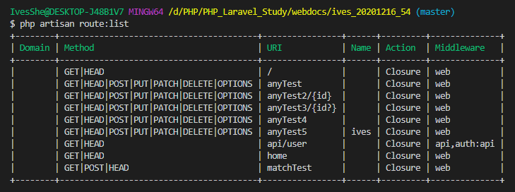
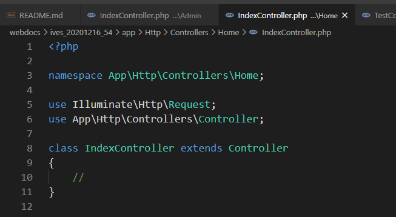

# PHP Laravel Study

# 可以使用PHP下載安裝

https://windows.php.net/download#php-7.3

# 或使用 PHPStudy下載安裝(集成環境)

https://www.xp.cn/download.html


# Composer下載安裝

https://getcomposer.org/download/


# Composer切換鏡像

https://pkg.phpcomposer.com/

# Composer部署laravel項目

```bash
# composer: 表示執行composer程序
# create-project: 通過composer去創建項目
# laravel/laravel: 需要創建的項目名稱
# --prefer-dist: 優先下載壓縮包方式，而不是直接從github上下載源碼(克隆)
# /: 表示創建的項目目錄名稱，也可以是一個目錄名

# laravel若不指定版本號，則默認使用最新的版本號

composer create-project laravel/laravel --prefer-dist ./

composer create-project laravel/laravel --prefer-dist ./QZ_04_1223
```

運行指令


得到這樣的目錄結構


```bash
# 下載其它版本號可使用下面命令
composer create-project laravel/laravel=5.4.*  --prefer-dist ./

composer create-project laravel/laravel=5.4.* --prefer-dist ./QZ_04_1224
```


```bash
composer create-project laravel/laravel=5.1.* --prefer-dist ./ives_2020122702
```


更新composer版本
```bash
composer self-update
```

# Laravel 目錄結構分析

每個版本似乎都不太相同，這邊看的是5.4.30


# 啟動Laravel - 方式一

不推薦這方式啟動

- 能夠跑php代碼，但是不啟動數據庫。
- 該方式啟動後，如果修改項目的配置.env的話，需要重啟才會生效。

```bash
php artisan serve
```


# 啟動Laravel - 方式二: 使用wamp或lamp

## 虛擬主機配置 (虛擬主機 不等於 虛擬機)

設定好之後，啟動apache之後，laravel文件若有存檔會自動更新

修改apache的虛擬主機vhost的配置文件


```conf
<VirtualHost *:80>
   # 配置站點管理員郵箱，當站點產生500錯誤的時候會顯示在頁面上
   ServerAdmin ivesshe@gmail.com
   # 站點的根目錄
   DocumentRoot "D:\PHP\PHP_Laravel_Study\webdocs\ives_20201216_54\public"
   FcgidInitialEnv PHPRC "D:/phpstudy_pro/Extensions/php/php7.3.4nts"
   AddHandler fcgid-script .php
   FcgidWrapper "D:/phpstudy_pro/Extensions/php/php7.3.4nts/php-cgi.exe" .php
   # DocumentRoot "${SRVROOT}/docs/dummy-host.example.com"

   # 站點需要綁定的域名
   ServerName www.1223.com
   #ServerName dummy-host.example.com

   # 服務器別名的域名
   ServerAlias 1223.com
   #ServerAlias www.dummy-host.example.com
   
   # 針對站點的詳細配置 
   # +是顯示目錄結構、-是關閉目錄結構，對外的網站需用-
   <Directory "D:\PHP\PHP_Laravel_Study\webdocs\ives_20201216_54\public">
     allow from all
     AllowOverride all
     Options +indexes 
   </Directory>
   ErrorLog "logs/dummy-host.example.com-error.log"
   CustomLog "logs/dummy-host.example.com-access.log" common
</VirtualHost>
```

## 修改hosts文件(線上的叫DNS域名解析)


# 路由


```php
Route::請求方式('請求的url',匿名函數或控制響應的方法)
```

```php
// 根路由 
Route::get('/', function () {
    return view('welcome');
});

Route::get('/home', function () {
    echo '當前訪問的地址是/home';
});

// any語法
Route::any('/anyTest', function () {
    echo '當前訪問的地址是/anyTest';
});

// match語法
Route::match(['get','post'],'/matchTest', function () {
    echo '當前訪問的地址是/matchTest';
});

// 必選參數
Route::any('/anyTest2/{id}', function ($id) {
    echo '當前訪問的地址是/anyTest2 , 當前用戶的id是 ' .$id;
});

// 可選參數
Route::any('/anyTest3/{id?}', function ($id='') {
    echo '當前訪問的地址是/anyTest3 , 當前用戶的id是 ' .$id;
});

// 通過?形式傳遞get參數
Route::any('/anyTest4', function () {
    echo '當前訪問的地址是/anyTest4  ' .$_GET['id'];
});


// 路由別名
Route::any('/anyTest5', function () {
    echo '當前訪問的地址是/anyTest5  ' .$_GET['id'];
}) -> name('ives');
```


查看系統已有的路由命令

```bash
php artisan route:list
```



# 路由群組

```php
// 路由群組
Route::group(['prefix' => 'admin'], function () {
    Route::get('test1', function () {
        echo '當前訪問的地址是/admin/test1';
    });

    Route::get('test2', function () {
        echo '當前訪問的地址是/admin/test2';
    });

    Route::get('test3', function () {
        echo '當前訪問的地址是/admin/test3';
    });
});
```


# 控制器-結構代碼生成

```bash
php artisan make:controller 控制器名(大駝峰) +Controller 關鍵詞
```

例如使用artisan命令創建TestController.php文件

```bash
php artisan make:controller TestController
```


# 控制器-路由(項目以該方式為主)

編寫路由規則：

設定路由： /home/test/test1         /p/c/a

```php
// 控制器路由寫法
Route::get('/home/test/test1', 'TestController@test1');
```


# 控制器-支持分目錄管理

1. 創建控制器目錄

2. 創建控制器文件(使用artisan命令創建)
```bash
php artisan make:controller Admin/IndexController

php artisan make:controller Home/IndexController
```




web.php
```php
// 分目錄管理
Route::get('/home/index/index', 'Home\IndexController@index');
Route::get('/admin/index/index', 'Admin\IndexController@index');
```


